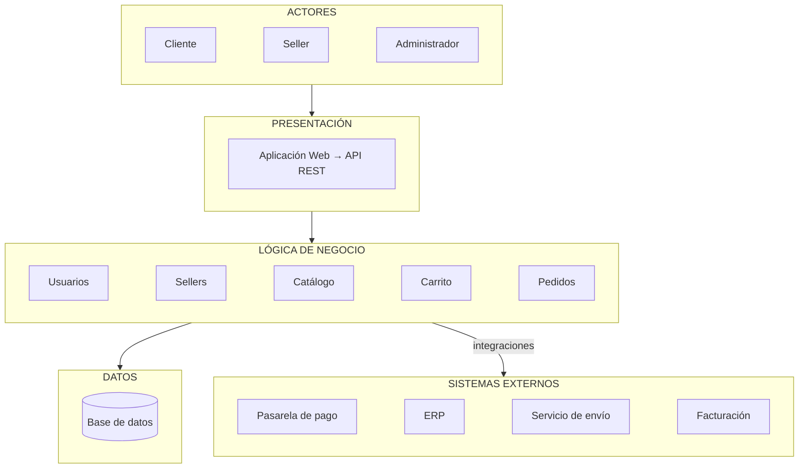

# Arquitectura inicial del sistema

## Diagrama de arquitectura

## Descripción

La arquitectura inicial se organiza en tres capas principales:

- **Presentación:** permite la interacción de los usuarios con el sistema mediante la aplicación web y la API REST.
- **Lógica de negocio:** contiene los módulos responsables de las funcionalidades: usuarios, sellers, catálogo, carrito y pedidos.
- **Datos:** permite almacenar y consultar la información mediante una base de datos.

Además, el módulo de **Pedidos** se integra con sistemas externos como la **pasarela de pago**, el **servicio de envío** y la **facturación**; el **Catálogo** consulta productos y stock al **ERP**.

## Capas y preguntas que responden
| Capa | Pregunta que responde |
|---|---|
| Presentación | ¿Cómo interactúa el usuario? |
| Lógica de negocio | ¿Qué hace el sistema? |
| Datos | ¿Dónde se almacena la información? |

## Trazabilidad con los drivers
| Driver | Decisión arquitectónica |
|---|---|
| DA01, DA02 | Capas desacopladas que permiten escalar la lógica de negocio por separado. |
| DA03 | Autenticación y autorización en la capa de lógica de negocio (módulo Usuarios). |
| DA04, DA06 | Integraciones a sistemas externos concentradas en Pedidos y Catálogo. |
| DA05 | La capa de presentación se comunica con el negocio solo vía API REST. |
| DA07 | Un módulo por responsabilidad. |