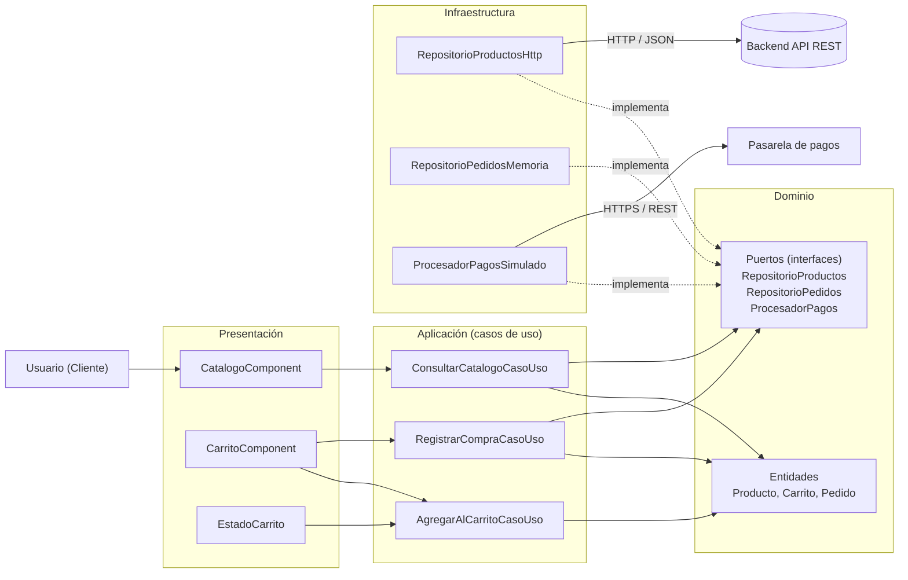

New-Item -ItemType Directory -Force -Path "arquitectura/enfoque" | Out-Null

@'
# Enfoque arquitectónico: Clean Architecture

**Proyecto:** Marketplace de productos para mascotas (referencia funcional: GoPet)
**Asignatura:** IS-488 Arquitectura de Software, 2026-II
**Autor:** Yery Cárdenas

---

## 1. Resumen del enfoque

| Elemento | Descripción aplicada al Marketplace |
|---|---|
| Patrón / enfoque arquitectónico | Clean Architecture (Arquitectura Limpia). |
| Objetivo | Separar responsabilidades y controlar las dependencias hacia el dominio. |
| ¿Qué problema resuelve? | Evita el acoplamiento entre la interfaz Angular, las reglas del negocio y las tecnologías externas, como bases de datos, API y servicios de pago. |
| Capas definidas | Presentación, Aplicación, Dominio e Infraestructura. |
| Beneficios | Facilita el mantenimiento y las pruebas unitarias. Permite cambiar implementaciones técnicas sin modificar innecesariamente las reglas del negocio. Mejora la organización y separación de responsabilidades del código. |
| Driver que lo motiva | DA06 Mantenibilidad / evolución modular (ver ADR-002). |

---

## 2. Capas y su ubicación en el proyecto

| Capa | Carpeta | Contiene | Ejemplos del marketplace |
|---|---|---|---|
| Dominio | `src/app/dominio/` | Entidades, reglas de negocio y puertos (interfaces) | `Producto`, `Carrito`, `Pedido`, `RepositorioProductos`, `RepositorioPedidos`, `ProcesadorPagos` |
| Aplicación | `src/app/aplicacion/` | Casos de uso que coordinan el dominio | `ConsultarCatalogoCasoUso`, `AgregarAlCarritoCasoUso`, `RegistrarCompraCasoUso` |
| Presentación | `src/app/presentacion/` | Componentes visuales y estado de la interfaz | `CatalogoComponent`, `CarritoComponent`, `EstadoCarrito` |
| Infraestructura | `src/app/infraestructura/` | Adaptadores que implementan los puertos del dominio | `RepositorioProductosHttp`, `RepositorioPedidosMemoria`, `ProcesadorPagosSimulado`, `NotificadorWhatsApp` |

Los nombres de carpetas y clases corresponden al proyecto base `boilerplate-main`.

---

## 3. Regla de dependencia

Las dependencias del código apuntan siempre **hacia el interior**, hacia el dominio.

1. El dominio no importa nada de las capas externas (ni Angular, ni HttpClient, ni RxJS).
2. Los casos de uso solo conocen entidades y contratos (interfaces).
3. Los adaptadores de infraestructura implementan los contratos definidos en el dominio (inversión de dependencias).
4. Cambiar de tecnología significa cambiar la configuración (`app.config.ts`), no el dominio.

| Capa | Puede importar de | No puede importar de |
|---|---|---|
| Dominio | Nada externo (TypeScript puro) | Aplicación, Presentación, Infraestructura, Angular |
| Aplicación | Dominio | Presentación, Infraestructura |
| Presentación | Aplicación, Dominio | Infraestructura |
| Infraestructura | Dominio (implementa sus contratos) | Presentación |

---

## 4. Diagrama de capas



### Leyenda

- Flecha continua: llamada en tiempo de ejecución.
- Flecha punteada `implementa`: inversión de dependencias. La infraestructura depende del dominio, no al revés.
- Las dependencias de código apuntan siempre hacia el dominio.

---

## 5. Ejemplo de flujo: agregar un producto al carrito

1. El usuario pulsa **Agregar** en `CatalogoComponent` (presentación).
2. El componente invoca a `AgregarAlCarritoCasoUso` (aplicación).
3. El caso de uso pide el producto a través de la interfaz `RepositorioProductos` (puerto del dominio).
4. En ejecución, esa interfaz está respaldada por `RepositorioProductosHttp` (infraestructura), que consulta la API REST.
5. El caso de uso entrega el producto a la entidad `Carrito` (dominio), que valida cantidad y stock y recalcula el subtotal.
6. `EstadoCarrito` (presentación) publica el nuevo estado y `CarritoComponent` se actualiza.

**Punto clave:** la entidad `Producto` no sabe si los datos vienen de HTTP, de memoria o de PostgreSQL. Solo conoce la interfaz `RepositorioProductos`.

---

## 6. Ejemplo de integración de pagos (ADR-004)

| Elemento | Capa | Rol |
|---|---|---|
| `ProcesadorPagos` | Dominio | Contrato (interfaz) que define qué debe hacer un procesador de pagos. |
| `RegistrarCompraCasoUso` | Aplicación | Usa el contrato, sin conocer al proveedor. |
| `ProcesadorPagosSimulado` | Infraestructura | Adaptador de pruebas. |
| `ProcesadorPagosCulqi` (futuro) | Infraestructura | Adaptador para la pasarela real. |

Para cambiar de proveedor se crea un nuevo adaptador y se registra en `app.config.ts`. El caso de uso y el dominio no se modifican.

---

## 7. Evidencia de auditoría de dependencias

Se revisaron las líneas `import` de cada capa para comprobar la regla de dependencia.

**Comando 1:** el dominio no debe importar Angular ni RxJS.

```powershell
Select-String -Path "boilerplate-main/src/app/dominio/**/*.ts" -Pattern "@angular|rxjs"
```

Resultado: *(pegar aquí la salida; lo esperado es ninguna coincidencia)*

**Comando 2:** dominio y aplicación no deben importar presentación ni infraestructura.

```powershell
Select-String -Path "boilerplate-main/src/app/dominio/**/*.ts","boilerplate-main/src/app/aplicacion/**/*.ts" -Pattern "infraestructura|presentacion"
```

Resultado: *(pegar aquí la salida; lo esperado es ninguna coincidencia)*

**Conclusión:** *(completar: indicar si se encontraron o no violaciones a la regla de dependencia)*

---

## 8. Relación con otras decisiones

- **ADR-002:** Clean Architecture.
- **ADR-001:** Monolito modular (el estilo global dentro del cual se aplica este enfoque).
- **ADR-004:** Integración de pagos mediante interfaces y adaptadores.
- **DA06:** Mantenibilidad / evolución modular.
'@ | Set-Content -Path "arquitectura/enfoque/enfoque-arquitectonico.md" -Encoding UTF8