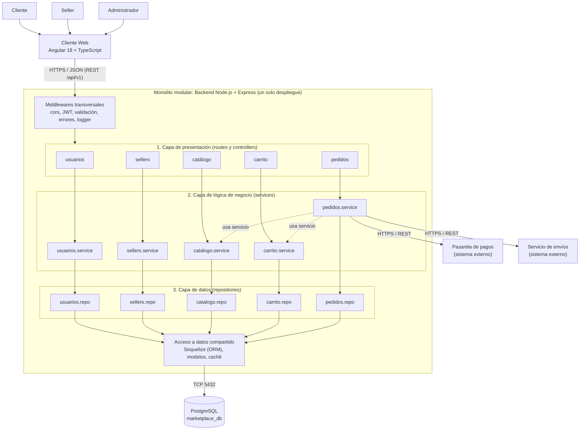

@'
# Estilo arquitectónico

**Proyecto:** Marketplace de productos para mascotas (referencia funcional: GoPet)
**Asignatura:** IS-488 Arquitectura de Software, 2026-II
**Autor:** Yery Cárdenas

---

## 1. Estilo seleccionado

**Monolito modular**, organizado internamente en **capas**, bajo un modelo **cliente-servidor**:

- **Cliente:** aplicación web SPA (Angular 18 + TypeScript).
- **Servidor:** un único backend (Node.js + Express) dividido en módulos de negocio.
- **Comunicación:** API REST sobre HTTPS con mensajes JSON.
- **Datos:** una base de datos relacional PostgreSQL.

> **Monolito** = unidad de despliegue (un solo proceso, una sola aplicación).
> **Modular** = organización lógica (módulos independientes dentro de ese proceso).

---

## 2. Justificación según los drivers

| Driver | Cómo lo atiende el estilo |
|---|---|
| DA01 Escalabilidad | El monolito se despliega en varias réplicas detrás de un balanceador (escalamiento horizontal). |
| DA02 Rendimiento | Un solo proceso evita latencia de red entre módulos; se añade caché para consultas frecuentes. |
| DA03 Seguridad | Un único punto de entrada permite aplicar autenticación (JWT) y autorización de forma centralizada. |
| DA04 Pago externo | Solo el módulo de Pedidos/Pagos se comunica con la pasarela, mediante un adaptador. |
| DA05 API REST | Frontend y backend se separan y se comunican solo por REST. |
| DA06 Mantenibilidad | Cada módulo tiene responsabilidades acotadas y no accede a los datos de otro módulo. |

---

## 3. Alternativas descartadas

| Alternativa | Motivo del descarte |
|---|---|
| Microservicios | Complejidad operativa (despliegue, red, trazabilidad) excesiva para el tamaño del equipo y del proyecto. |
| Monolito sin módulos | Alto acoplamiento; un cambio afecta otras funcionalidades (incumple DA06). |
| Serverless | Dependencia del proveedor y dificultad para controlar estado y conexiones a la base de datos. |
| Event-driven | No hay un requisito que justifique la complejidad de brokers y consistencia eventual. |

---

## 4. Diagrama de arquitectura

### Leyenda

- Flecha continua: llamada síncrona entre capas (de arriba hacia abajo).
- Flecha punteada: uso entre módulos, solo a través de su *service*.
- Recuadro `MONO`: límite del monolito (un solo proceso Node.js).
- `PostgreSQL`, pasarela de pagos y servicio de envíos: sistemas fuera del monolito.

---

## 5. Componentes principales

| Componente | Responsabilidad |
|---|---|
| Cliente Web (Angular) | Interfaz de usuario: catálogo, carrito y pago. |
| Middlewares | Seguridad, validación de entrada, manejo de errores y registro de logs. |
| Módulo Usuarios | Registro, login y roles. |
| Módulo Sellers | Alta de tiendas y validación. |
| Módulo Catálogo | Productos, categorías y stock. |
| Módulo Carrito | Ítems y totales. |
| Módulo Pedidos | Checkout, estados, integración con pago y envío. |
| Acceso a datos compartido | ORM, modelos, pool de conexiones y caché. |
| PostgreSQL | Persistencia de datos. |
| Pasarela de pagos / Envíos | Sistemas externos, integrados mediante adaptadores. |

---

## 6. Reglas del estilo

1. Cada capa solo invoca a la capa inmediatamente inferior.
2. Un módulo **no accede** al repositorio ni a las tablas de otro módulo.
3. La comunicación entre módulos se hace llamando a su *service*.
4. Todo el backend se ejecuta en un único proceso Node.js con una única base de datos.
5. Los sistemas externos se acceden solo desde el módulo que los necesita, mediante interfaces y adaptadores (ver ADR-004).

---

## 7. Relación con otras decisiones

- **ADR-001:** Monolito modular.
- **ADR-002:** Clean Architecture (enfoque interno, desarrollado en `enfoque/enfoque-arquitectonico.md`).
- **ADR-003:** Estrategia de caché.
- **ADR-004:** Integración de pagos mediante interfaces y adaptadores.
'@ | Set-Content -Path "arquitectura/estilo-arquitectonico.md" -Encoding UTF8